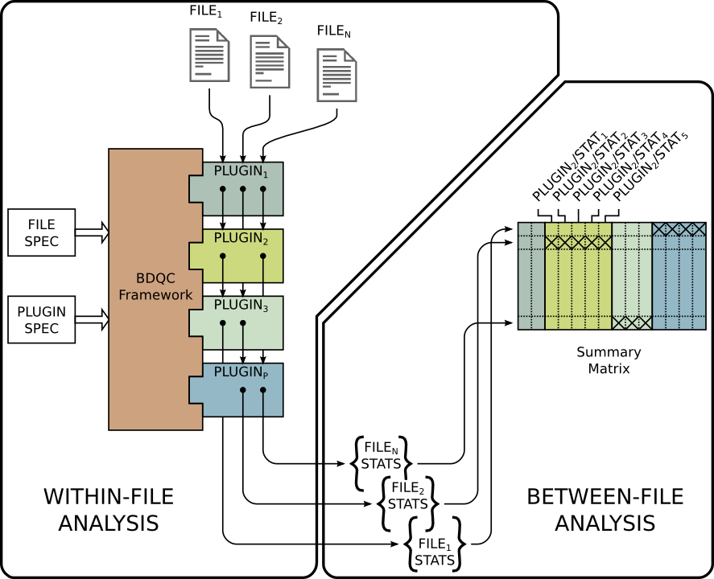

Table of Contents
#################

- Installation_
- Overview_

	- `What is it?`_
	- `What is it for?`_
	- `What does it do?`_
- `How does it work?`_
- Plugins_

Installation
############

The BDQC framework has no requirements other than Python 3.3.2 or later.
The GCC toolchain is required for installation as some of its
components are C code that must be compiled.

After extracting the archive...

.. code-block:: shell

	python3 setup.py install

...installs the framework, after which...

.. code-block:: shell

	python3 -m bdqc.scan <directory>

...will analyze all files in <directory>, and

.. code-block:: shell

	python3 -m bdqc.scan --help
	
...provides further help.
The contents of the online help is not repeated in this document.

Overview
########

What is it?
===========

BDQC is a Python3_ software framework and executable module.
Although it provides built-in capabilities that make it useful "out of the
box", being a "framework" means that users (knowledgeable in Python
programming) can extend its capabilities, and it is *intended* to
be so extended.

What is it for?
===============

BDQC identifies anomalous files among large collections of files which are
*a priori* assumed to be "similar."
It was motivated by the realization that when faced with many thousands of
individual files it can be challenging to even confirm they all contain
approximately what they should.

It is useful for:

1. validating primary input data to pipelines
2. validating output (or intermediate stages of) data processing pipelines
3. discovering potentially "interesting" outliers

These use cases merely highlight different sources of anomalies in data.
In the first, anomalies might be due to faulty data handling or acquisition
(e.g. sloppy manual procedures or faulty sensors). In the second, anomalies
might appear in data due to bugs in pipeline software or runtime failures
(e.g. power outages, network unavailablity, etc.). Finally, anomalies that
can't be discounted as being due to technical problems might actually be
"interesting" observations to be followed up in research.

Although it was developed in the context of genomics research, it is 
expressly not tied to a specific knowledge domain. It can be customized
as much as desired (via the plugin mechanism) for specific knowledge domains.

Importantly, *files* are its fundamental unit of operation.
This means that a file must constitute a meaningful unit of
information--one sample's data, for example--in any
application of BDQC.

What does it do?
================

BDQC analyzes a collection of files in two stages.
First, it analyzes each file individually and produces a summary of the
file's content (`within-file analysis <Within-file analysis>`_).
Second, the aggregated file summaries are analyzed heuristically
(`between-file analysis <Between-file analysis_>`_) to identify possible anomalies.

The two stages of operation can be run independently.

BDQC can be run from the command line, and command line arguments control
which files are analyzed,
how files are summarized,
how the summaries are aggregated and finally analyzed.
All command line arguments are optional; the framework will carry out
default actions. See command line help.

Alternatively, the bdqc.Executor Python class can be incorporated directly
into third party Python code. This allows it to be incorporated into
pipelines.

Results
-------

A successful run of bdqc.scan ends with one of 3 general results:

1. nothing of interest found ("Everything is OK.")
2. two or more files were found to be *incomparable*
3. anomalies were detected in specific files

Files are considered "incomparable" when they are *so* different (e.g.
log files and JPEG image files) that comparison is essentially meaningless.

A file is considered "anomalous" when one or more of the statistics that
plugins compute about it are "outliers," either in the usual sense of the
word or another sense explained more fully below (in `Between-file analysis`_).

In the second and third cases, a report is optionally generated (as text or HTML)
summarizing the evidence.

Design goals
============

The BDQC framework was developed with several explicit goals in mind:

1. Identify an "anomalous" file among a large collection of *similar* files of *arbitrary* type with as little guidance from the user as possible, ideally none.  In other words, it should be useful "out of the box" with almost no learning curve.
2. "Simple things should be simple; complex things should be possible" [#]_ Although basic use should involve almost no learning curve, it should be possible to extend it with arbitrarily complex (and possibly domain-specific) analysis capabilities.
3. Plugins should be simple (for a competent Python programmer) to develop, and the framework must be robust to faults in plugins.

How does it work?
#################

This section describes in more detail how BDQC works internally.
This and following sections are required reading for anyone
wanting to develop their own plugins.

The most important fact to understand about BDQC is that
**plugins, not the** *framework*, **carry out all within-file analysis of input files.**
The BDQC framework merely orchestrates the execution of `plugins <Plugins_>`_
and performs the final *across-file* analysis, but only plugins
examine a files' content.
(The BDQC *package* includes several "built-in" plugins which insure
it is useful "out of the box." Though they are built-in, they are
nonetheless plugins because the follow the plugin architecture.)

A plugin is simply a Python module that is installable like any Python module.
Plugins provide functions that can read a file and produce one or more summary
statistics about it.
The functions are expected to take certain forms, and the plugin is expected to
export certain symbols used by the BDQC framework (described in detail
`below <Plugins_>`_).

Within-file analysis
====================

The plugins that are executed on a file entirely determine
the content of the summary (the statistics) generated for that file.
The framework itself *never* looks inside a file; only the plugins examine
file content.

The framework:

1. assembles a list of paths identifying files to be analyzed,
2. executes a *dynamically-determined* subset of the available plugins on each file path,
3. merges the plugins' results into one (JSON_-format) summary per analyzed file.

Each `plugin <Plugins_>`_ can declare (as part of its implementation) that it depends
on zero or more other plugins.

The framework:

1. insures that a plugin's dependencies execute before the plugin itself, and
2. each plugin is provided with the results of its *declared* dependencies' execution.

By virtue of their declared dependencies, the set of all plugins available
to BDQC (installed on the user's computer and visible on the PYTHONPATH)
constitute a directed acyclic graph (DAG), and a plugin that is "upstream"
in the DAG can determine how (or even whether or not) a downstream plugin runs.

The framework minimizes work by only executing a plugin when required.
The figure above represents the skipping of plugins; plugin *#3*, for example,
was not run on file *#N*.

.. TODO: cover the rerun decision tree.

By default, the summary for file foo.txt is left in an adjacent file named
foo.txt.bdqc.

Again, the BDQC *framework* does not touch files' content; it only
handles filenames and paths.

Between-file analysis
=====================

1. Summary (\*.bdqc) files are `collected <Collection_>`_.
2. All files' summaries (the JSON_-formatted content of all corresponding \*.bdqc files) are `flattened <Flattening_>`_ into a matrix.
3. `Heuristic analysis is applied <Heuristic Analysis_>`_ to the columns of the matrix to identify rows (corresponding to the original files) that might be anomalies.

The framework (bdqc.scan or bdqc.analysis) exits with a status code indicating
the overall analysis result: no anomalies, incomparable files, anomalies detected
(or an error occurred).

**Two or more files are considered incomparable when their summaries do not
contain the same set of statistics.** This typically only occurs when files
are so different that different plugins ran, and it is usually the result of
insufficiently constraining the bdqc.scan run
(see the --include and --exclude options).
It can also occur when \*.bdqc files from different bdqc.scan runs are
inappropriately aggregated in an independent bdqc.analysis run.

When incomparable files are detected it is impossible to determine which, if
any, are anomalous.

Collection
----------

Typically bdqc.scan automatically invokes the between-files analysis on
the results of within-file analysis.
However, the between-file analysis can also be run independently, and files
listing and/or directories containing \*.bdqc files to analyze can be
specified exactly as with bdqc.scan. See

.. code-block:: shell

	python3 -m bdqc.analysis --help

Flattening
----------

A `plugin's <Plugins_>`_ output can be (almost) anything
representable as JSON_ data.
In particular, the "statistic(s)" produced by a plugin need not be scalars
(numbers and strings); they can be compound data like matrices or sets.
However, currently only scalar statistics are used in subsequent analysis.

Since JSON_ is inherently hierarchical (because it supports compound types),
the individual statistics in plugins' summaries are
necessarily identified by *paths* in the JSON_ data.
For example, the following excerpt of output from the bdqc.builtin.tabular_
plugin's analysis of *one file* shows some of the many statistics it produces:

.. code-block:: JSON

	{
		"non_utf8": 0, 
		"table": {
			"metadata_prefix": "", 
			"lines_empty": 0, 
			"lines_data": 29, 
			"lines_meta": 0, 
			"lines_aberrant": 0,
			"column_count": 170, 
			"columns": [
				{
					"type": "string", 
					"class": "categorical",
					"label_set_hash": "E02B9961"
				}, 
				{
					"type": "string", 
					"class": "unknown"
				}, 
				{
					"type": "float", 
					"class": "quantitative",
					"stats": {
						"stddev": 3.812, 
						"mean": 47.38
					}
				}, 
				{
					"type": "int", 
					"class": "categorical",
					"label_set_hash": "8D4D4E1B"
				}, 
				...
			]
		}
	}

The plugin inferred that the 3rd column in the file contains quantitative
data ("class"), and the mean value of that column was 47.38.
The process of "flattening" the JSON summaries creates one column in the
aggregate matrix from the values of the mean statistic *for all files analyzed*,
and that column's *name* is the path:

	bdqc.builtin.tabular/table/columns/2/stats/mean.

These paths can be used to make heuristic analysis selective. (See
heuristic configuration (TODO)).

In summary, each \*.bdqc file contains all plugins' statistics for one
analyzed file; each column in the aggregate matrix contains one statistic
(from one plugin) for all files analyzed.

.. The columns of the matrix are the individual statistics that plugins produce
.. in their analysis summaries.

Heuristic Analysis
------------------

Within-file analysis (and BDQC itself) is based on a simple heuristic:

	**Files that** *a priori* **are expected to be "similar" should be
	effectively** *identical* **in specific, measurable ways.**

For example, files that are known to contain tabular data typically should
have identical column counts. This need not *always* be the case, though,
which is why it is a *heuristic*.

In concrete terms this means that each column in the summary matrix should
contain *a single value*. (e.g. The bdqc.builtin.tabular/table/column_count
column in the summary matrix should contain only one value in all rows.)

If the column is not single-valued, then the analyzed files corresponding to
rows containing the minority value(s) will be reported as anomalies.

Clearly, this heuristic cannot be applied to quantitative data since it
usually contains *noise* inherent in the phenomena itself or its measurement.
However, a "relaxation" of the heuristic still applies:
a quantitative statistic should manifest *central tendency* and an *absence*
of outliers ("outliers" in the usual univariate statistical sense of the word).

For example, files containing genetic variant calls of many individuals
of the same species (one individual per file), performed on the same
sequencing platform, called by the same variant-calling algorithm, etc.
should typically be *approximately* the same size (in bytes).

Note that inference of statistical class (quantitative, categorical)
relies on inference of data *type* (integer, floating-point, or
string). See `Type inference`_ below.

Finally, missing data is also treated as anomalous. A statistic that
contains a value of null (None in Python) is *always* considered an
anomaly.

Thus, BDQC identifies anomalous files by three different indicators:

	1. outliers in *quantitative* data (the usual sense of the word "outlier")
	2. outliers in categorical data defines as the minority value(s) when a categorical column contains more than one value
	3. missing values

Obviously, **plugins must support these rationale** by only producing
statistics that satisfy them (when files are "normal").

Finally, because heuristics are *by definition* not universally applicable,
plugins' output (the statistics) can be filtered so that the heuristic is
applied selectively. For example, in a particular context "normal" files
containing tabular data may actually be expected to contain variable column
counts, so this should not be reported as an anomaly.
(See heuristic configuration).

Plugins
#######

The BDQC executable *framework* does not itself examine files' content.
All *within-file* analysis is performed by plugins.
Several plugins are included in (but are, nonetheless, distinct from) the
framework. These plugins are referred to as "`Built-ins`_".

A plugin is simply a Python module with several required and optional
elements shown in the example below.

.. code-block:: python

	VERSION=0x00010000
	DEPENDENCIES = ['bdqc.builtin.extrinsic','some.other.plugin']
	def process( filename, dependencies_results ):
		# Optionally, verify or use contents of dependencies_results.
		with open( filename ) as fp:
			pass # ...do whatever is required to compute the values
		# returned below...
		return {
			'a_quantitative_statistic':1.2345,
			'a_3x2_matrix_of_float_result':[[3.0,1.2],[0.0,1.0],[1,2]],
			'a_set_result':['foo','bar','baz'],
			'a_categorical_result':"yes" }

Plugins must satisfy several constraints:

1. Every plugin *must* provide a two-argument function called process.
2. A plugin *may* provide a list called DEPENDENCIES (which may be empty). Each dependency is a fully-qualified Python package name (as a string).
3. A plugin *may* include a VERSION declaration. If present, it must be convertible to an integer (using int()).
4. The process function *must* return data built entirely of the basic Python types:
	1. dict
	2. list
	3. tuple
	4. a scalar (int, float, string)
	5. None

These requirements do not limit what a plugin can *do*.
They merely define a *packaging* that allows the plugin to be hosted
by the framework. In particular, a plugin may invoke compiled code (e.g.
C or Fortran) and/or use arbitrary 3rd party libraries using standard
Python mechanisms.

Moreover, while a plugin is free to return multiple statistics,
the `Unix philosophy`_ of "Do one thing and do it well" suggests that a
plugin *should* return few statistics (or even only one).
This promotes reuse, extensibility, and unit-testability of plugins, and is
part of the motivation behind the plugin architecture.

There is no provision for passing arguments to plugins from the framework
itself. Environment variables can be used when a plugin must be
parameterized.

Developers are advised to look at the source code of any of the built-in
plugins for examples of how to write their own. The bdqc.builtin.extrinsic_
is a very simple plugin; bdqc.builtin.tabular_ is much more complex and
demonstrates how to use C code.

The framework will incorporate the VERSION number, if present, into the plugin's output
automatically. The plugin's code need not (and *should* not) include it in the
returned value. The version number is used by the framework (along with other factors) to decide
whether to *re*-run a plugin.

A plugin *should* return a Python dict with the name(s) of its statistic(s) as keys.
If a plugin returns any of the other allowed types, the framework will wrap it in
a dict and its value will be associated with the key "value."

Built-ins
=========

The BDQC software package includes several built-in plugins so that it is
useful "out of the box." These plugins provide very general purpose analyses
and assume *nothing* about the files they analyze.
Although their output is demonstrably useful on its own, the built-in plugins
may be viewed as a means to "bootstrap" more specific (more domain-aware)
analyses.

bdqc.builtin.extrinsic
----------------------

.. warning:: Unfinished.

bdqc.builtin.filetype
---------------------

.. warning:: Unfinished.

bdqc.builtin.tabular
--------------------

.. warning:: Unfinished.

.. Framework execution
.. ###################
.. 
.. After parsing command line arguments the framework (bdqc.scan):
.. 
.. 1. builds a list *P* of all candidate plugins
.. 2. identifies an ordering of plugins that respects all declared dependencies
.. 3. builds a list *F* of files to be (potentially) analyzed
.. 4. for each file *f* in *F*, for each plugin *p* in *P* it runs *p* on *f* *if it needs to be run*.
.. 
.. The files to be analyzed as well as the set of candidate plugins are
.. controlled by multiple command line options. See online help.
.. 
.. These steps always happen.
.. Aggregate analysis--that is, analysis of the plugins' analyses--is
.. carried out if and only if a file is specified (with the {\tt --accum}
.. option) to contain the plugins' results.
.. 
.. Whether a plugin is actually run on a file depends on global options,
.. the existence of earlier analysis results, the modification time of
.. the file and the version (if present) of the plugin.
.. 
.. A plugin is run on a file:
.. 1. if the --clobber flag is included in the command line; this forces (re)run and preempts all other considerations.
.. 2. if no results from the current plugin exist for the file.
.. 3. if results exist but their modification time is older than the file.
.. 4. if any of the plugin's dependencies were (re)run.
.. 5. when the plugin version is (present and) newer (greater) than the version that produced existing results.

Advanced topics
###############

Aggregation and "flattening" of JSON data
=========================================

The JSON_-formatted summaries generated by plugins are hierarchical in nature
since JSON_ Objects and Arrays can each contain other JSON_ Objects and Arrays.

The process of flattening the JSON_ to produce the summary matrix
need not, in general, result in columns of *scalars* (eg. numbers and string
labels).
Although it is always possible to arrive at columns of scalars by flattening ("exploding")
JSON_ compound objects *exhaustively*, the process is intentionally *not* exhaustive by default.
Because we want plugins to be able to return compound values as results (e.g. sets,
vectors, matrices) *without complicating JSON by defining special labeling
requirements*, the following rules and conventions are observed:

	1.	Arrays of values of a single *scalar type* are not flattened (e.g. an Array with only Numbers).
	2.	Nested Arrays--Arrays that contain other Arrays of *identical dimension*--are also not flattened.

Arrays of the first type are interpreted as either vectors (1D matrices) or *sets*.
An Array is interpreted as a set when and only when it contains *non-repeated*
String values.

BDQC interprets the second use of JSON_ Arrays as matrices. For example, in...

.. code-block:: JSON

        "foo.bar": {
            "baz": [
                [ 1, 2 ],
                [ 3, 4 ],
                [ 5, 6 ],
                [ 7, 8 ],
            ],
            "fuz": [
                [ [ "a", "b", "c", "d" ], [ "e", "f", "g", "h" ] ],
                [ [ "i", "j", "k", "l" ], [ "m", "n", "o", "p" ] ],
                [ [ "q", "r", "s", "t" ], [ "u", "v", "w", "x" ] ],
            ],
            "woz": [ "none","of","these","strings","are","repeated" ],
            ...
        }

1. foo.bar/baz will be treated as a 4x2 (numeric) matrix.
2. foo.bar/fuz will be treated as a 3x2x4 (String-valued) matrix.
3. foo.bar/woz will be treated as a *set*.

An Array that contains *any* JSON_ Objects is *always* further flattened.

Type inference
==============

TODO

Terms and Definitions
#####################

within-file analysis
between-file analysis
summary matrix
heuristic

Footnotes
#########

.. [#] `Alan Kay`_

.. Collected external URLS

..	_Python3: https://wiki.python.org/moin/Python2orPython3
..	_`Unix philosophy`: https://en.wikipedia.org/wiki/Unix_philosophy
..	_`Alan Kay`: https://en.wikipedia.org/wiki/Alan_Kay
..	_JSON: http://json.org

